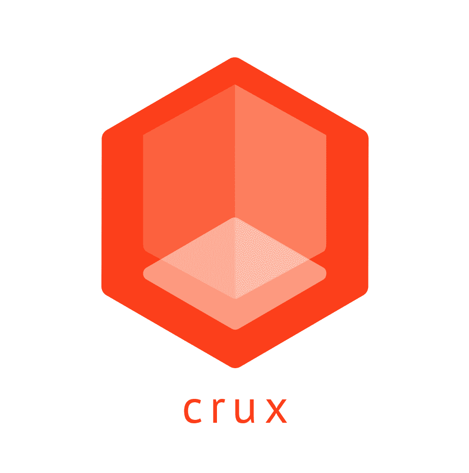

<div align="center"><p width="300px"></div>

# Crux

**The framework for long-lived code in browser-based TypeScript/Javascript apps**

The core concept of `crux` is that you shouldn't be locked-into a single framework that defines the structure of your code and makes it difficult to change. Instead, the majority of your code should be framework-agnostic, written in the language of your domain, and should be able to simply plug-in to a minimal core. `crux` is that core.

`crux` supports "micro-frontends", enabling large codebases to be split into smaller, more manageable, components. Small teams can work independently, allowing them to add code and deploy independently, focussing only on the parts of the site that are relevant to them.

`crux` enables you to transition to a separate framework without doing a complete re-write of the code. Apps written in a single framework, and built around that framework, are essentially technical debt because the amount of work required to move off that framework at some point grows with every line of code added. `crux` encourages you to write code that doesn't rely on a framework and so can be more easily transitioned as your business requirements change.

In summary, `crux`:

- is a Typescript/Javascript web-app framework for the browser
- promotes highly-decoupled and long-lived code
- provides simple integration for micro-frontends
- lowers your level of technical debt.

## Usage

```ts
import { createApp } from 'crux';
import { layout } from 'my-app/layout';
import { post } from 'my-app/views';
import { posts, user } from 'my-app/modules';

const app = createApp({
  // App root element
  el: document.getElementById('app'),

  /*
  * The job of the layout is to control the top-level HTML of the app.
  * It is a function that returns an object with an `update` method,
  * called on every "dispatch".
  *
  * The layout defines view roots, to which the app attaches and
  * instantiates views as necessary.
  *
  * The layout can use any view framework.
  */
  layout,

  /**
   * Modules define the business logic of the app. They can define
   * events that are called by "dispatch" and can emit events of their
   * own for views to consume.
   */
  modules:  {
    /**
     * Modules can be imported dynamically and lazily instantiated to save time
     * on page load.
     */
    posts: () => import('my-app/modules/posts').then(mod => mod.posts()),
    user,
  },

  /**
   * A small and lightweight router is provided.
   */
  routes: {
    post: '/posts/:id',
    posts: {
      path: '/posts',
      /**
       * If dynamically imported modules are required for a path, they can be referenced here.
       */
      modules: ['posts'],
    },
  },

  /*
   * Views can be written independently in any framework, and are instantiated
   * individually on an element root provided by the layout. They can subscribe
   * to events emanating from the modules
   */
  views: {
    post,

    /**
     * Views can also be imported dynamically.
     */
    posts: () => import('my-app/views/posts').then(mod => mod.posts()),
  },
});
```

`layout` is a simple function that returns an object with an `update` method. When `update` is called, the template updates and renders the layout into the DOM.

It is the job of the layout to provide root elements for the views, and it does this by attaching `data-view-id` attributes to those roots. In this way, it is completely decoupled from the views, and can therefore be written in a separate framework or none at all.

This example of the `layout` uses `lit-html`:

```ts
import { html, render } from 'lit-html';

export function layout({
  el, modules, router,
}) {
  return {
    update,
  };

  function template(route: Router.RouteData | null) {
    switch (route?.name) {
      case 'post':
        return html`<div data-view-id="post"></div>`;
      case 'posts':
        return html`<div data-view-id="posts"></div>`;
      default:
        return html`<div>Home</div>`;
    }
  }

  function update({ modules, router }) {
    const currentRoute = router.getCurrentRoute();

    render(template(currentRoute), root);
  }
}
```

In the example above, the `layout` provides root elements for `post` and `posts`. These are the "views" that we defined earlier. After the template is rendered, `crux` will first `unmount` any views that no longer exist, and `mount` any new views defined by the `layout`. The views, therefore, hook into these lifecyle events by providing `mount` and `unmount` functions to enable the view to initialise and destroy itself:

```ts
/**
 * The view accepts the `context` as a parameter when instantiated, and also on both
 * mount and unmount.
 **/
export function post({ el, modules, router }) {
  return {
    mount, unmount,
  };

  function mount({ el, modules, router }) {
    const postId = router.getCurrentRoute()?.params.id;

    el.innerHTML = `postId: ${postId}`;
  }

  function unmount({ el, modules, router }) {
    el.innerHTML = '';
  }
}
```

`mount` and `unmount` can also be asynchronous. If asynchronous setup work needs to be done in the views, `crux` will queue any further events until the `Promise` has returned.
