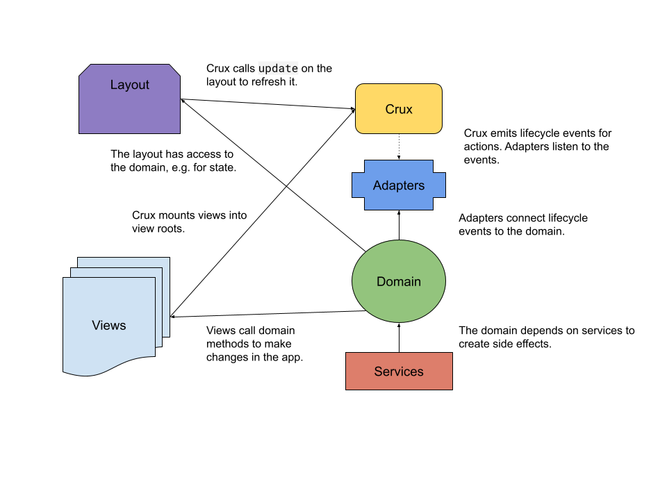

# Crux

**NB: `crux` is still in alpha at the moment, so in no way should it be used for production as the API is almost certain to change very soon**

`crux` aims to guide you into writing code that is long-lived. This means that the code is:

* easy to change incrementally without losing structure and organisation
* structured in such a way that is logical and re-usable
* easy to test, without complex mocking and highly-coupled specialist testing libraries

`crux` enables the simple integration  "micro-frontends", enabling large codebases to be split into smaller, more manageable, components. Small teams can work independently, allowing them to add code and deploy independently, focussing only on the parts of the site that are relevant to them even if they use different view libraries and patterns.

The key takeaways for crux are:

* it is a Typescript/Javascript web-app framework for the browser,
* it promotes highly-decoupled and long-lived code,
* it does not tie your code to a single view library (e.g. Vue, React),
* it provides simple integration for micro-frontends,
* it lowers your level of technical debt,
* it is fully-featured but is tiny (< 7KB all-in)

## Architecture

`crux` is designed to decouple important aspects of your code. Firstly, it encourages you to put your business logic into a `domain`. This code is framework-agnostic and has any dependencies injected in. Its dependencies are going to be things like data, cache, routing, etc.

Not only does it decopule your business logic, but it decouples your views too. You provide a `layout`, which defines mount roots for your views, which `crux` mounts them into. This means that your views can each be in different frameworks (if you so wish), becuse they're just functions that run to mount into a root when required.

Let's take a look at the overview of the `crux` architecture:



## Packages

`crux` uses various libraries, maintained in this repo, and free for you to use in your own projects.

* [async-queue](packages/async-queue/README.md)
* [di](packages/di/README.md)
* [event-emitter](packages/event-emitter/README.md)
* [fsm](packages/fsm/README.md)
* [router](packages/router/README.md)
* [store](packages/store/README.md)
* [sync-queue](packages/sync-queue/README.md)

## Contributing

### Adding a new package

```bash
yarn nx g @nrwl/workspace:lib [name] --buildable --publishable --dryRun
```

### Building a package

```bash
yarn nx build http --prod
```

### Publishing a package

```bash
cd dist/packages/http

npm publish --access public
```
